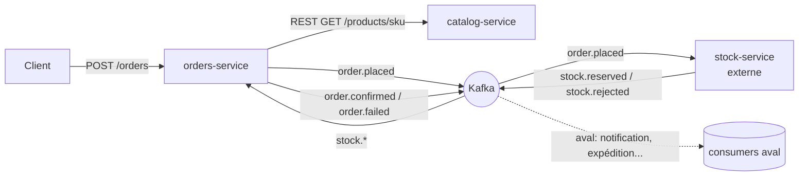
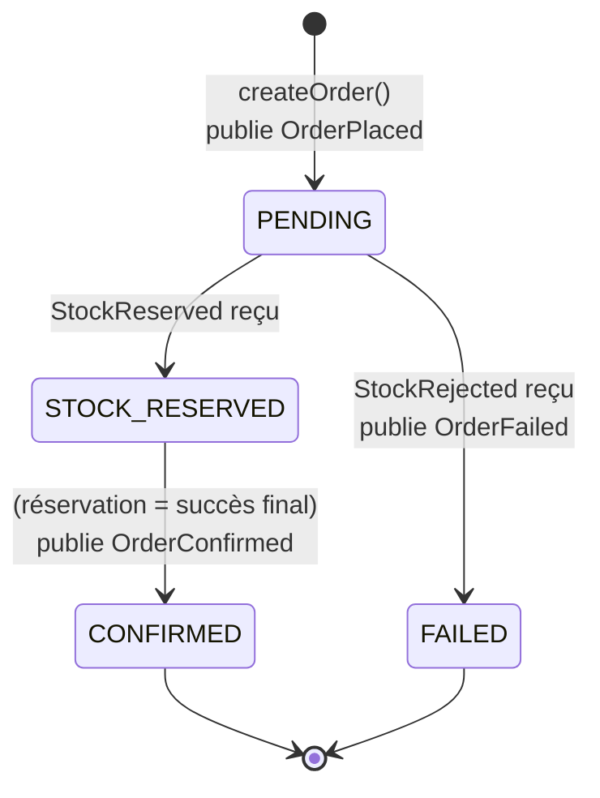
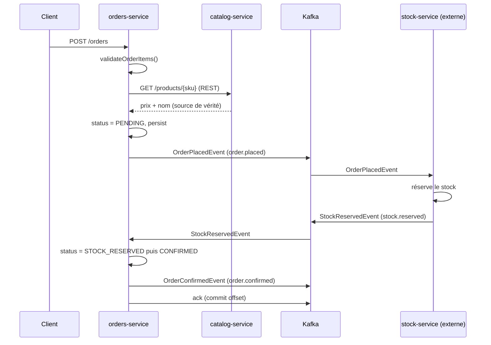

# 🔄 Saga — Flux, événements et transitions d'état

Documentation du Saga *chorégraphié* (event-driven, sans orchestrateur central) de la
plateforme retail. Cette page décrit le parcours d'une commande, les événements Avro
échangés via Kafka, et la machine à états de `OrderEntity`.

> Périmètre : `orders-service` (ce repo) ↔ `stock-service` (**micro-service externe**).
> `catalog-service` n'est **pas** dans le Saga : il est interrogé en **REST synchrone**
> pour enrichir la commande (source de vérité prix/nom). Voir [Pourquoi REST](#pourquoi-catalog-service-reste-en-rest).

---

## 1. Vue d'ensemble

| Service | Rôle | Transport |
| --- | --- | --- |
| **orders-service** | Création de commande + réactions Saga | Produit/consomme Kafka, appelle catalog en REST |
| **catalog-service** | Source de vérité produits (SKU, prix, nom) | **REST** uniquement |
| **stock-service** *(externe)* | Réservation / rejet de stock | Produit/consomme Kafka |

---

## 2. Catalogue des événements (contrats Avro)

Tous les schémas vivent dans le module **`retail-event-schema`** (`src/main/avro/`) et sont
générés en classes Java `SpecificRecord` (`enableDecimalLogicalType=true`, `stringType=String`).

| Événement | Topic | Producteur | Consommateur | Schéma |
| --- | --- | --- | --- | --- |
| `OrderPlacedEvent` | `order.placed` | orders-service | stock-service | `avro/order/OrderPlacedEvent.avsc` |
| `StockReservedEvent` | `stock.reserved` | stock-service | orders-service | `avro/stock/StockReservedEvent.avsc` |
| `StockRejectedEvent` | `stock.rejected` | stock-service | orders-service | `avro/stock/StockRejectedEvent.avsc` |
| `OrderConfirmedEvent` | `order.confirmed` | orders-service | aval (notif, expédition…) | `avro/order/OrderConfirmedEvent.avsc` |
| `OrderFailedEvent` | `order.failed` | orders-service | aval (notif, compensation…) | `avro/order/OrderFailedEvent.avsc` |

**Clé Kafka = `orderId`** pour tous les événements → tous les messages d'une même commande
tombent dans la **même partition**, garantissant l'ordre de traitement (condition essentielle au Saga).

### Conventions Schema Registry

- **Subject naming** : `TopicNameStrategy` (défaut) → subject = `<topic>-value`.
- **Compatibilité** : mode `BACKWARD` (défaut). Tout nouveau champ doit avoir un `default`
  (cf. `version` qui vaut `"v1"`).
- **Montants** : `decimal(precision=19, scale=2)` → `java.math.BigDecimal`, normalisé en `scale=2`
  avant sérialisation (`setScale(2, HALF_UP)`).
- **Dates** : `timestamp-millis` → `java.time.Instant`.

---

## 3. Machine à états de la commande

### Diagramme

### Tableau des transitions

| État départ | Déclencheur | État arrivée | Effet de bord | Where |
| --- | --- | --- | --- | --- |
| — | `POST /orders` validée + persistée | **PENDING** | publie `OrderPlacedEvent` → `order.placed` | `OrderServiceImpl.createOrder` |
| PENDING | reçoit `StockReservedEvent` | **STOCK_RESERVED** | save (réservation actée) | `StockEventListener.onStockReserved` |
| STOCK_RESERVED | (immédiat, pas d'étape paiement) | **CONFIRMED** | publie `OrderConfirmedEvent` → `order.confirmed` | `StockEventListener.onStockReserved` |
| PENDING | reçoit `StockRejectedEvent` | **FAILED** | publie `OrderFailedEvent` → `order.failed` | `StockEventListener.onStockRejected` |

> ℹ️ `onStockReserved` enchaîne **deux** transitions dans la même transaction :
> `STOCK_RESERVED` puis `CONFIRMED`. La réservation est **actée avant** la confirmation
> (deux `save` successifs) — on ne saute jamais directement à `CONFIRMED`.

### États déclarés mais non encore utilisés

L'enum `OrderStatus` prévoit des états pour une évolution future, **non câblés** aujourd'hui :

| État | Usage prévu |
| --- | --- |
| `STOCK_CHECKING` | Attente active de la réponse stock |
| `PAYMENT_PROCESSING` | Étape paiement (quand un `payment-service` existera) |
| `CANCELLED` | Annulation client |
| `REJECTED` | Rejet métier distinct de `FAILED` |

> Quand un `payment-service` sera ajouté, la confirmation devra migrer **après**
> `PAYMENT_PROCESSING` : le bloc « réservation → confirmation » de `onStockReserved`
> sera alors à scinder (`STOCK_RESERVED` ici, `CONFIRMED` déclenché par l'événement paiement).

---

## 4. Séquence nominale (succès)

Chemin d'échec : `stock-service` publie `StockRejectedEvent` → `orders-service` passe la
commande en `FAILED` et publie `OrderFailedEvent`.

---

## 5. Garanties & invariants

- **Idempotence à la création** : `OrderEntity.idempotencyKey`. Si une clé fournie par le
  client existe déjà, la commande est renvoyée sans nouvelle création
  (`OrderServiceImpl` — `findByIdempotencyKey`). Une clé absente est générée aléatoirement
  (donc *pas* d'idempotence pour ces requêtes — comportement assumé).
- **Ordre par commande** : clé Kafka = `orderId` → 1 partition par commande.
- **Ack manuel** : consumers en `AckMode.MANUAL`. L'offset n'est commité qu'après traitement.
  Si la commande est introuvable, on `ack` quand même (rejouer n'aiderait pas → évite le *poison pill*).
- **Validation avant enrichissement** : `validateOrderItems()` s'exécute **avant** l'appel
  REST catalog → évite un `NullPointerException` sur `items == null` et des appels inutiles.

---

## 6. Provisioning des topics

`orders-service` crée explicitement (beans `NewTopic` dans `KafkaTopicsConfig`) **uniquement
les topics qu'il possède** (domaine `order`) : `order.placed`, `order.confirmed`, `order.failed`
— 3 partitions, réplication 1 (broker unique en local).

Les topics `stock.reserved` / `stock.rejected` sont la responsabilité du **stock-service**
(leur producteur). orders-service ne fait que les consommer.

---

## 7. Pourquoi catalog-service reste en REST

catalog-service est un **fournisseur de données de référence** interrogé en **requête/réponse
synchrone** (récupération prix/nom au moment de créer la commande). C'est le cas d'usage de REST,
pas de Kafka :

| Critère | catalog lookup | événement Saga |
| --- | --- | --- |
| Interaction | question/réponse immédiate | asynchrone, fire-and-forget |
| Couplage temporel | acceptable | à éviter |
| Bon transport | **REST / RestClient** | **Kafka + Avro** |

`ProductEntity` ne porte d'ailleurs **aucune notion de stock** — la réservation est un bounded
context distinct (le `stock-service`). Mettre un lookup produit sur Kafka serait une erreur d'architecture.

---

## 8. Limites connues / durcissements à venir

- **Transactional outbox** : la publication Kafka se fait dans la transaction DB. En cas de
  crash entre le commit DB et l'envoi Kafka, l'événement peut manquer. Un *outbox* fiabiliserait.
- **Dead Letter Topic** : le `DefaultErrorHandler` se contente de logger les messages illisibles.
  Ajouter un `DeadLetterPublishingRecoverer` pour router les *poison pills*.
- **Partage du contrat Avro inter-repos** : `retail-event-schema` n'est pas publié
  (install local). Pour éviter le *drift* de schéma avec le stock-service externe, publier le
  module dans un repo Maven partagé **ou** traiter le Schema Registry comme source de vérité.
- **Compensation** : pas de rollback de stock si une étape ultérieure échoue (pertinent quand
  un `payment-service` existera).